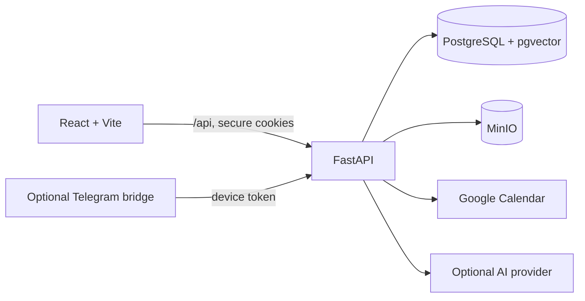

# Architecture

Second Brain is a small monorepo with one React client and one FastAPI service.
PostgreSQL is the source of truth; MinIO stores uploaded files.



## Repository map

```text
apps/
  web/        React, TypeScript, Vite, module UI
  api/        FastAPI, SQLAlchemy, Alembic, background sync
  bot/        Optional Telegram client
docs/public/  Public user and contributor documentation
infra/        Container and deployment support files
scripts/      Development lifecycle and deterministic demo data
```

## Request lifecycle

1. Vite proxies `/api` to FastAPI in development; nginx does the same in the
   production container.
2. FastAPI authenticates the secure access cookie and resolves the current
   user.
3. Route modules apply ownership or sharing rules before querying SQLAlchemy.
4. PostgreSQL stores structured state. MinIO stores file bodies while the
   database keeps metadata and ownership.
5. The API returns typed JSON consumed by small module-level frontend clients.

## Data boundaries

All primary records are scoped to a user or to a resource with an explicit
share. Pages and calendar events can be joined through a generic link table.
Workout and meal records can create or reference calendar events, which keeps
planning and logging connected without duplicating module logic.

The assistant is a client of the same internal API rather than a privileged
parallel backend. Its capability registry assigns risk levels, confirmation
requirements, and undo behavior to individual operations.

## Frontend structure

The client is organized by product module under `apps/web/src/modules`.
Authenticated routes share the application rail, settings context, and
assistant panel. CSS custom properties in `apps/web/src/styles.css` provide the
theme and spacing vocabulary; responsive module styles collapse sidebars and
adapt grids at narrow widths.

## Backend structure

FastAPI routers live under `apps/api/app/routes`. SQLAlchemy models are
centralized so Alembic can generate a single migration graph. Service modules
own Google/ICS sync and assistant internals. The API runs migrations before
startup in its production container.

## Storage and background work

- PostgreSQL stores accounts, calendars, pages, fitness, food, shares, links,
  settings, and assistant state.
- pgvector supports semantic search indexes used by the assistant.
- MinIO stores note images, meal photos, and other uploaded file bodies.
- An in-process scheduler polls configured Google and ICS calendars. The
  single-node deployment model keeps this deliberately simple.
