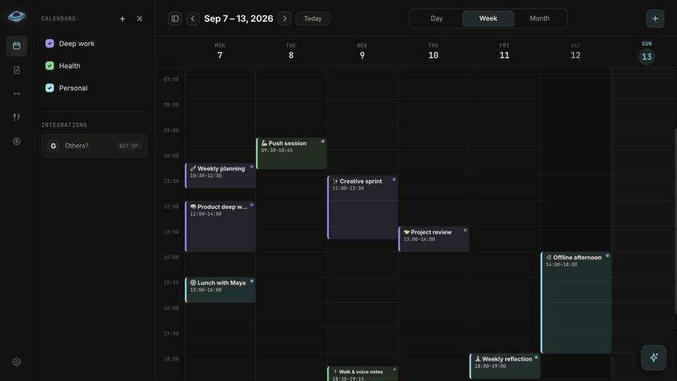
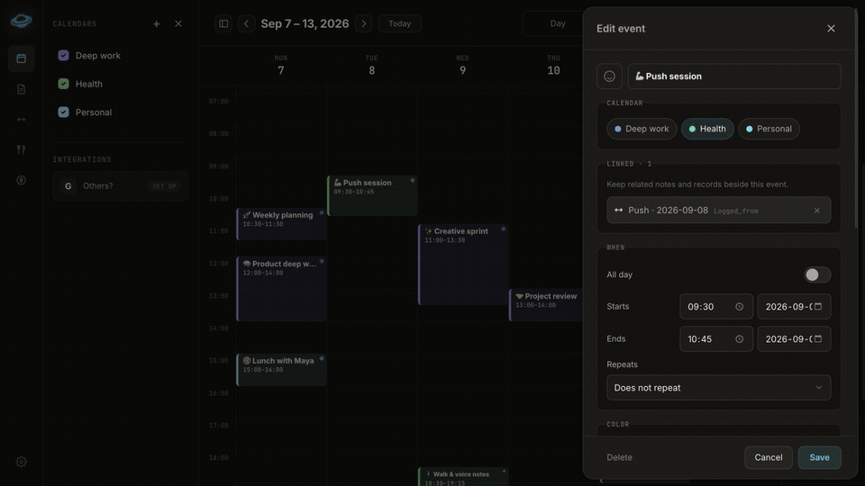
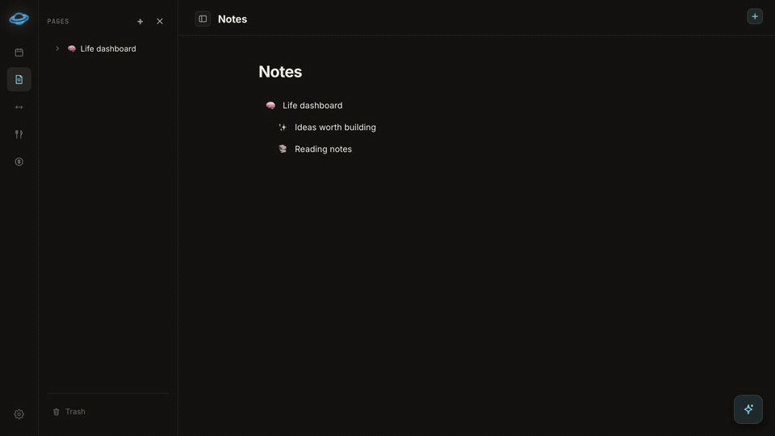
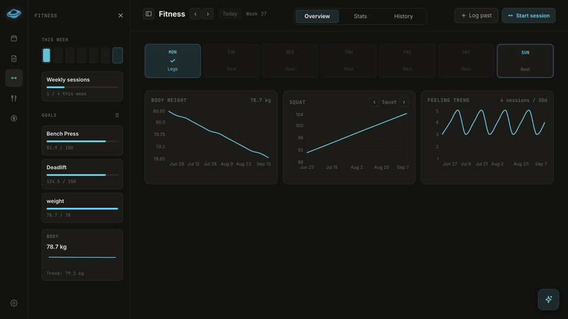
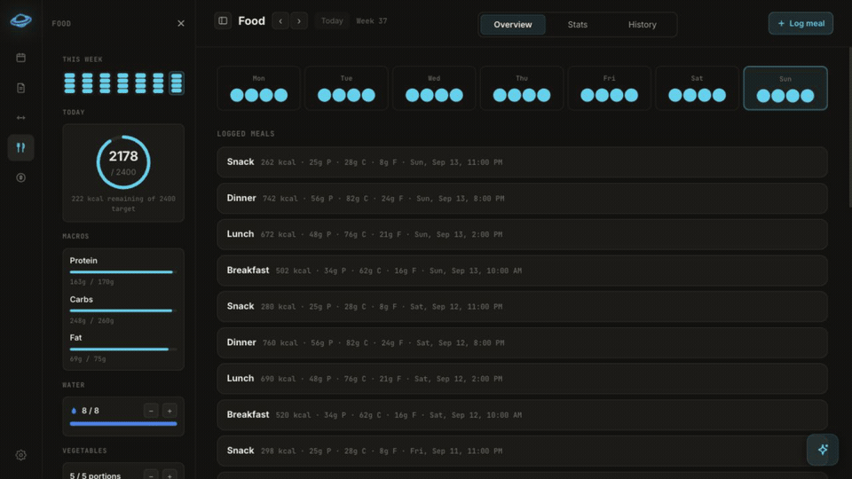
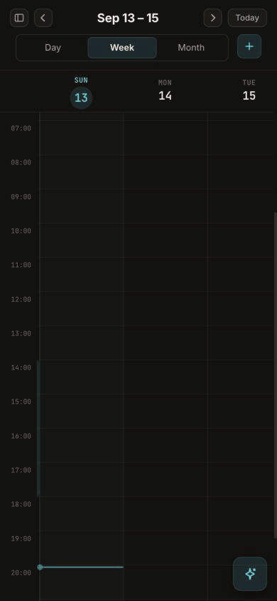

# Feature guide

Second Brain treats calendar events, notes, workouts, and meals as connected
parts of one system. The interface is fully responsive; the same workflows are
available on desktop and mobile.

## Calendar

- Switch between day, adaptive week, and month views.
- Create multiple color-coded local calendars and hide them independently.
- Create timed or all-day events with icons, locations, links, reminders, and
  recurring schedules.
- Edit a single occurrence, future occurrences, or an entire recurring series.
- Copy, move, and batch-edit selected events.
- Connect Google calendars through OAuth or subscribe to read-only ICS feeds.
- Share a calendar with another local account as a viewer or editor.
- Draft a note, planned workout, or planned meal directly from an event.

### Connected workflow: event → workout

Create a planned workout from an event and Second Brain keeps a typed
relationship between the records. The event shows the linked workout, selecting
it opens that exact workout in Fitness, and fields managed by the destination
record are protected from conflicting edits. Event → note and event → meal use
the same connected workflow.

## Notes and pages

- Build a nested page tree with icons, covers, drag ordering, and trash restore.
- Write rich content with headings, tasks, lists, callouts, code, math, tables,
  images, bookmarks, and multi-column layouts.
- Search titles and content across the workspace.
- Mention other pages and inspect backlinks.
- Link pages to calendar events and other pages.
- Create database pages with properties, saved views, filters, and duplication.
- Share a page with another account and collaborate through persisted CRDT
  updates.
- Export a page as PDF.

## Fitness

- Plan a workout from Fitness or from a calendar event.
- Run a live strength or cardio session with set tracking and a rest timer.
- Log previous workouts, RPE, per-set feeling, distance, and duration.
- Maintain a personal exercise library.
- Track body weight, weekly frequency, and strength or body-metric goals.
- Inspect personal records, estimated one-rep max, training volume, maximum
  weight, body-weight trends, and session feeling.

## Food

- Plan or log breakfast, lunch, dinner, and snacks.
- Track calories, protein, carbohydrates, fat, water, vegetables, and fruit.
- Set per-user daily targets and review weekly progress at a glance.
- Attach multiple photos and optionally estimate nutrition through OpenRouter.
- Review calorie, hydration, produce, and body-weight trends.
- Open, edit, or remove entries from the meal history.
- Plan a meal from a calendar event and keep both records synchronized.

## Embedded assistant

The assistant opens from every authenticated screen and works against the same
API used by the interface.

- Ask questions across calendar, notes, fitness, and food data.
- Create or update records through explicit tools.
- Require confirmation for writes and higher-risk actions.
- Review and undo supported actions.
- Control individual capabilities, memories, skills, and conversation history.
- Import or export the assistant's knowledge bundle.
- Connect a Telegram bot through a short-lived device approval flow.

AI features require a configured provider. Core calendar, notes, fitness, and
food workflows work without one.

## Accounts, sharing, and settings

- Password login with secure cookies, refresh-token rotation, rate limiting,
  and optional TOTP two-factor authentication.
- Admin-only account creation, role management, deactivation, and test-account
  controls.
- Page and calendar sharing between local accounts.
- Dark, light, and system themes plus multiple visual styles.
- Timezone, week-start, time-format, calendar, editor, fitness, food, and AI
  preferences.
- JSON data export from Settings.

## Mobile

At narrow widths, navigation collapses into drawers, the calendar adapts its
visible day range, action bars wrap for touch, and module sidebars become
on-demand panels. No separate mobile app is required.
