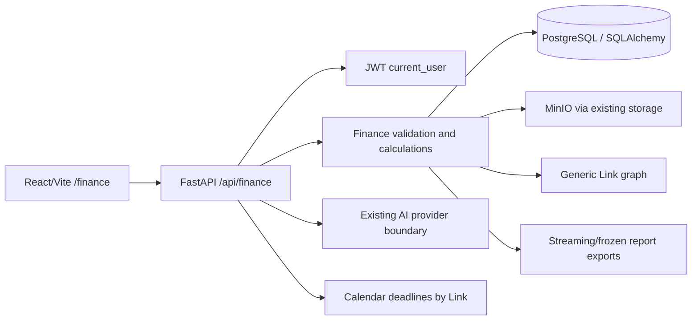

# Finance module system architecture

## Architectural style

Finance is a bounded module in the existing FastAPI/React modular monolith. It shares the
application database, authentication, object storage and graph with Calendar, Notes, Fitness
and Food. It does not create a parallel web app or service boundary.



## Repository layout

```text
apps/web/src/
  App.tsx                         # /finance route and lazy import
  components/AppRail.tsx         # activate existing Finance rail item
  lib/api.ts                      # authenticated finance calls
  modules/finance/
    Finance.tsx                   # route shell and section state
    finance.css                   # finance-only styles using global tokens
    api.ts                        # typed finance API functions
    types.ts                      # API/domain display types
    Overview.tsx, Activity.tsx    # progressive-disclosure views
    Review.tsx, Accounts.tsx
    Assets.tsx, Evidence.tsx
    Reports.tsx, AssistantPanel.tsx

apps/api/app/
  models.py                       # finance ORM models
  routes/finance.py               # authenticated task-oriented endpoints
  services/finance_*.py           # only shared parser/ledger/report logic
  tests/test_finance_*.py         # invariants and API integration tests
  alembic/versions/029+_finance_*.py
```

The first vertical slice may keep a small amount of logic in `routes/finance.py`. Extract a
service only when parsing, revision creation, posting generation or reporting is shared by
multiple endpoints. Do not create speculative repositories or package layers.

## Bounded responsibilities

- **Sources/imports:** accounts, source files, parser mappings, raw imports/records, duplicate
  detection and rejected rows.
- **Evidence:** immutable source objects, hashes, metadata, extraction status and links to
  events. Reuse MinIO; do not weaken the Notes image upload contract.
- **Ledger:** canonical financial events, immutable revisions, components, postings, lots,
  positions, valuations and reconciliation.
- **Review:** proposals, compatible grouping, confirmation/split/defer, reusable policies and
  open questions.
- **Tax:** tax profiles, residency facts, versioned candidate/confirmed treatments and traces.
- **Reports:** frozen snapshots, schedules, evidence indexes, manifests and exports.
- **Assistant:** scoped read tools and confirmation-based proposals; no unrestricted SQL.

## Data-flow rule

```text
uploaded/API source
  -> immutable object + raw import
  -> parser preview and mapping
  -> raw records
  -> canonical event proposal
  -> event revision
  -> components/postings/lots/valuations
  -> review group and treatment
  -> frozen report snapshot/export
```

No stage edits or deletes the source stage. A correction creates a new derived revision and an
audit entry. Grouping is presentation metadata and never replaces member events.

## Consistency and authorization

- A confirmed event revision and its postings are committed in one database transaction.
- Object bytes are stored before the evidence/import row is committed.
- Every mutation accepts an idempotency key where retrying could create financial state.
- Every finance query filters through `current_user` ownership, including linked nodes and
  evidence files.
- Reports reference explicit event, valuation, treatment and evidence revision IDs.
- Exported packages are immutable snapshots; later corrections invalidate only future runs.

## API surface

All paths are same-origin `/api` paths and require the existing authenticated dependency.

- `GET /api/finance/summary`
- `GET /api/finance/activity`
- `GET/POST /api/finance/accounts`
- `GET/POST /api/finance/assets`
- `POST /api/finance/imports/preview`
- `POST /api/finance/imports/{id}/commit`
- `GET /api/finance/review-groups`
- `POST /api/finance/review-groups/{id}/confirm`
- `POST /api/finance/review-groups/{id}/split`
- `POST /api/finance/reconciliations/run`
- `POST /api/finance/reports`
- `GET /api/finance/reports/{id}/download`
- `GET /api/finance/events/{id}/lineage`

AI-specific tools may call the same domain functions behind typed server endpoints, but the
model never receives credentials or unrestricted SQL.
