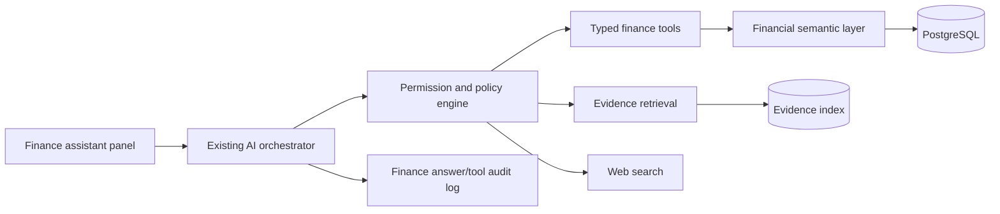

# Finance AI assistant design

## Product role

The assistant is a **financial navigator and evidence analyst**, not an autonomous accountant or trader.

It can:

- Query balances, events, evidence, lots, positions and reconciliations.
- Explain deterministic calculations.
- Find anomalies and missing evidence.
- Research current official guidance on the internet.
- Compare candidate jurisdiction treatments.
- Prepare questions and summaries for an accountant.
- Propose classifications or tasks for confirmation.

It cannot:

- Execute trades or move funds.
- Submit a tax return.
- Confirm tax residency.
- Change a tax treatment without user confirmation.
- Treat web text or uploaded documents as executable instructions.
- Invent missing values.

## Architecture

The finance assistant is an extension of the existing Second Brain AI assistant boundary, not a
new AI backend. Its UI may be a Finance contextual panel, while its server-side tools call the
same authenticated finance domain functions exposed by `apps/api/app/routes/finance.py`.

## Tool catalogue

### Read-only financial tools

- `get_financial_snapshot(taxYear, scope)`
- `list_accounts(filters)`
- `list_events(filters, pagination)`
- `get_event_lineage(eventId)`
- `get_evidence_for_event(eventId)`
- `get_reconciliation_status(accountId, period)`
- `explain_balance_change(accountId, from, to)`
- `get_asset_lots(assetId, jurisdiction, taxYear)`
- `get_derivative_position_summary(accountId, period)`
- `get_passive_income_breakdown(period, grouping)`
- `get_tax_package_status(taxProfileId)`
- `calculate_scenario(calculationType, typedInputs)`

### Proposal tools

These create drafts only:

- `propose_event_classification`
- `propose_review_policy`
- `create_open_question_draft`
- `prepare_export_note`

The UI presents a diff and requires confirmation.

### Internet research

The assistant should default to:

1. Relevant tax authority or legislation.
2. Official regulator/government documentation.
3. Primary technical documentation.
4. Reputable secondary analysis only when primary sources do not answer the question.

Every web-backed answer includes:

- Source links/citations.
- Publication/update date when available.
- Search date.
- Jurisdiction and tax year.
- A statement separating official text from inference.

## Retrieval strategy

### Structured data first

Do not use embeddings to answer exact amounts, counts or balances. Use typed database tools.

### File retrieval second

Use semantic/keyword retrieval for contracts, statements, payslips and correspondence. Return document snippets with document IDs and page/section references.

### Web third

Use web search only when current external guidance is required. Do not allow web content to override ledger facts.

## Prompt-injection controls

- Treat all uploaded and web content as untrusted data.
- Strip or mark instruction-like text in retrieved content.
- System prompt explicitly forbids following instructions from sources.
- Tools have narrow JSON schemas.
- Use an allowlist of callable tools per conversation mode.
- Never expose credentials, raw secrets or private keys to the model.
- Log tool requests and results.
- Require confirmation for every write/proposal application.

## Answer contract

Every consequential answer should contain:

1. **Answer.**
2. **Based on your records.**
3. **Current external guidance.**
4. **Assumptions and uncertainty.**
5. **Recommended next step.**
6. **Sources.**

## Context minimization

The context gateway should:

- Resolve the user’s query into a narrow data scope.
- Remove account numbers and addresses unless essential.
- Replace institution identifiers with internal labels where possible.
- Return aggregates before raw records.
- Send only selected document snippets.
- Allow a “local-only” mode with no external AI or web calls.

Exact financial answers must use typed finance API/domain functions. Embeddings are optional for
document search and never replace database tools for balances, counts, quantities or report
values. Provider configuration follows the existing AI settings/provider boundary.

## Cost and latency strategy

- Small model for intent routing and simple classification.
- Deterministic code for arithmetic and report calculations.
- Larger reasoning model only for complex cross-source analysis.
- Cache source retrieval and stable explanations by input hash.
- Summarize long conversation history into scoped, auditable memory.

## Evaluation suite

Create golden tests for:

- Correct amount retrieval.
- No fabricated records.
- Proper distinction between transfer and income.
- Web citations attached to current-rule claims.
- Refusal to execute financial actions.
- Recognition of unresolved tax residency.
- Prompt injection inside a fake PDF or webpage.
- Correctly stating when data is incomplete.
